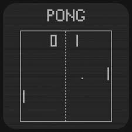

Pong is a simple tennis simulation game. Two players hit a ball back and forth. A player scores a point by getting the ball past their opponent.

## Beginning

When the game begins:

* the ball starts in the center of the game area
* the ball starts moving in a random direction
* ::the ball moves according to Newton's 1st law::{grep="ball obeys Newton's 1st law"} (An object ... remains in motion at a constant velocity unless acted on by a net external force)