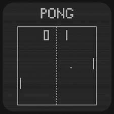
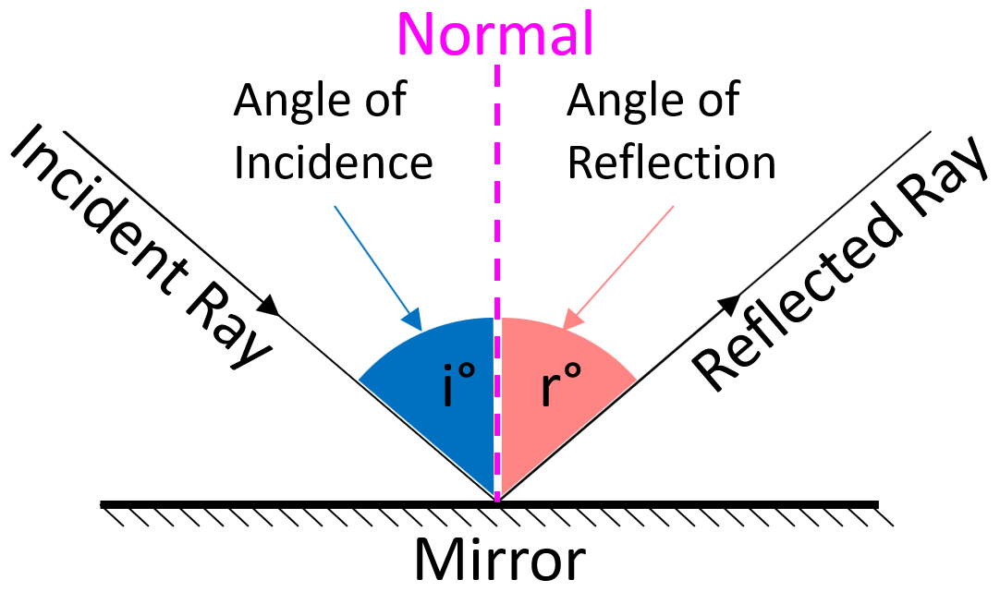

Pong is a simple tennis simulation game. This pong variant has a single player, controlling a paddle to hit the ball back at a wall. 

## Beginning

When the game begins:

* ::the ball starts in the center of the game area::{grep="the ball starts in the center of the game area"}
* ::the ball starts moving in a random direction::{grep="the ball does not always start in the same direction"}
* ::the ball moves according to Newton's 1st law  (An object ... remains in motion at a constant velocity unless acted on by a net external force)::{grep="ball obeys Newton's 1st law"}

## Collisions

### Wall Collisions

* When the ball hits the top, right, or bottom edge of the game area it bounces, with the angle of incidence equal to the angle of reflection, plus a small random component to prevent infinite bounces at 90 and 270 degrees.

### Paddle Collisions

When the ball hits the paddle it bounces, with the angle of incidence equal to the angle of reflection, plus a small random component to prevent infinite bounces at 90 and 270 degrees.

## Misses

* When the player misses the ball (the ball reaches the left edge of the game area without overlapping the paddle) the player's score decreases by 1, and a new ball is started.  